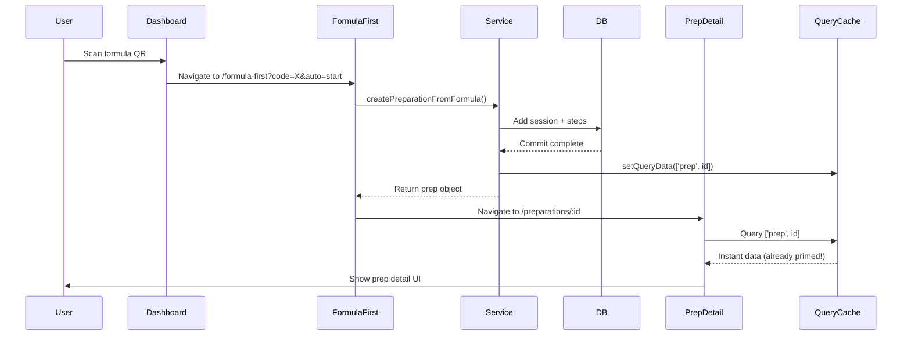
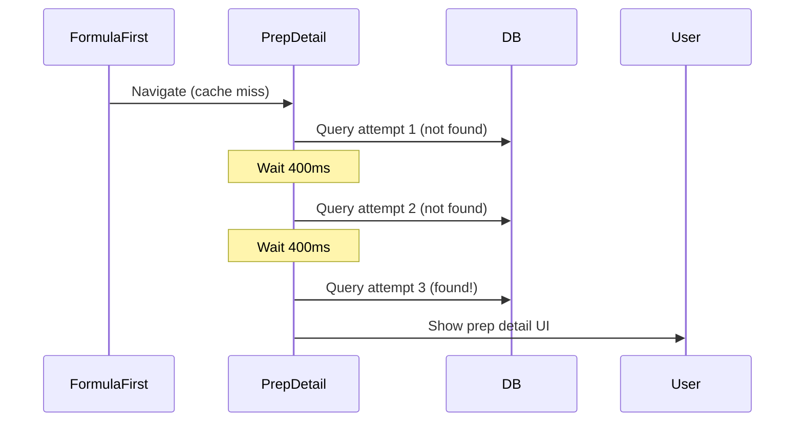
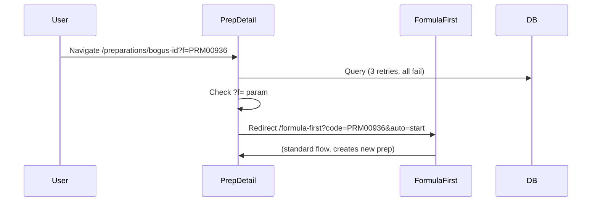

# Preparation Creation Flow

## Overview

This document describes the **deterministic preparation creation flow** that ensures:
1. ✅ Preparations are **created before navigation** (no more "Preparation not found")
2. ✅ The detail page **retries briefly** to allow DB commits to complete
3. ✅ QR scans route consistently via a **centralized service**
4. ✅ The react-query cache is **primed** for instant display

---

## Architecture

### 1. Centralized Service: `src/services/preparations.ts`

**Purpose:** Single source of truth for creating preparations from formulas.

**Key Function:**
```typescript
createPreparationFromFormula(
  formula: Formula,
  opts?: { amount?: number; unit?: string; operator?: string }
): Promise<Preparation>
```

**What it does:**
- Generates UUID for new preparation
- Calculates attempt number (count + 1)
- Creates session in `db.sessions`
- Creates steps in `db.steps` from formula ingredients
- Logs `SESSION_START` event
- **Primes react-query cache** with `queryClient.setQueryData()`
- Returns the preparation object

**Why this matters:**
- Before: FormulaFirst created prep inline, then navigated immediately → race condition
- After: Single async function that awaits all DB operations, then returns

---

### 2. FormulaFirst Auto-Start: `src/pages/FormulaFirst.tsx`

**Flow:**
1. Read `?code=` and `?auto=start` from URL
2. Query formula by code (or internalCode)
3. If `auto=start` and formula found:
   - **Await** `createPreparationFromFormula()` (dynamic import)
   - **Then** navigate to `/preparations/:id`
4. If formula not found, show error

**Key Code:**
```typescript
const prep = await createPreparationFromFormula(
  formulaByCode.data,
  { amount, unit, operator: user?.name || 'operator' }
);

console.debug('[formula-first] created prep:', prep.id);
navigate(`/preparations/${prep.id}`, { replace: true });
```

**Why this matters:**
- Navigation happens **only after** DB commit completes
- No more navigating to a prep ID that doesn't exist yet

---

### 3. PreparationDetail Retry Logic: `src/features/preparations/PreparationDetails.tsx`

**Flow:**
1. Uses `useQuery` with `retry: 3` and `retryDelay: 400ms`
2. Total retry window: ~1.2 seconds (3 × 400ms)
3. If prep still not found after retries:
   - Check for `?f=` (formula fallback) in URL
   - If present, redirect to `/formula-first?code=X&auto=start`
   - Otherwise, show "Preparation not found"

**Key Code:**
```typescript
const prepQ = useQuery({
  queryKey: ['prep', id],
  queryFn: async () => { /* fetch from db.sessions + db.steps */ },
  enabled: !!id,
  retry: 3,           // Brief retry to allow creation commit
  retryDelay: 400,
});
```

**Why this matters:**
- Handles edge cases where navigation happens fractionally before IndexedDB commit
- Provides a safety net without blocking the UI indefinitely

---

### 4. Universal Scan Routing: `src/lib/handleScanNavigation.ts`

**Flow:**
1. Decode QR with `decodeQR(raw)` (from `src/lib/qr.ts`)
2. Route based on type:
   - `formula` → `/formula-first?code=X&auto=start`
   - `prep` → `/preparations/:id`
   - `sample` → `/samples?search=X`

**Key Code:**
```typescript
case 'formula': {
  const params = new URLSearchParams({ code: qr.code, auto: 'start' });
  nav(`/formula-first?${params.toString()}`);
  break;
}
```

**Why this matters:**
- All scans (dashboard, wedge scanner, manual input) use the same routing logic
- Guarantees that formula QR codes **always** trigger auto-start

---

## End-to-End Flow

### Happy Path: Formula QR → Prep Detail



**Key insight:** The cache is primed *before* navigation, so the detail page loads instantly.

---

### Edge Case: Race Condition (Handled)

If cache priming fails or DB is slow:



**Total retry time:** 1.2 seconds max

---

### Edge Case: Prep Not Found with Formula Fallback

If user navigates to `/preparations/bogus-id?f=PRM00936`:



**Why this exists:** QR codes might encode prep IDs that don't exist locally yet (e.g., syncing from another device).

---

## Testing

### E2E Tests: `e2e/formula-start.spec.ts`

**Test Cases:**
1. ✅ **Happy path:** Formula code creates prep and lands on detail
2. ✅ **Invalid code:** Shows "Formula not found" error
3. ✅ **Prep fallback:** Bogus prep ID + `?f=` bounces to formula-first
4. ✅ **Manual mode:** Formula-first without `auto=start` doesn't auto-create

**Run tests:**
```bash
pnpm test:e2e
```

**Before running:**
- Ensure test DB has a formula with code `PRM00936` (or update the test)
- Vite dev server must be running on port 5173

---

## Configuration

### Query Client: `src/lib/queryClient.ts`

Now exported as a singleton for reuse across the app:

```typescript
export const queryClient = new QueryClient({
  defaultOptions: {
    queries: {
      retry: 1,
      refetchOnWindowFocus: false,
      staleTime: 0,
    },
  },
});
```

**Used by:**
- `src/App.tsx` (wraps app with QueryClientProvider)
- `src/services/preparations.ts` (primes cache after creation)

---

## Migration Notes

### Before (Old Flow)
- FormulaFirst created prep inline with `db.sessions.add()`
- Immediately navigated to `/preparations/:id`
- PreparationDetail loaded from DB (no retry)
- **Result:** "Preparation not found" if DB commit was slow

### After (New Flow)
- FormulaFirst calls `createPreparationFromFormula()`
- Waits for async completion
- Primes react-query cache
- Then navigates
- PreparationDetail retries 3 times (1.2s window)
- **Result:** Instant load, with safety net for edge cases

---

## Benefits

1. **Deterministic:** Prep always exists before navigation
2. **Fast:** Cache is primed, detail page loads instantly
3. **Resilient:** Retry logic handles slow DB commits
4. **Testable:** E2E tests verify end-to-end flow
5. **Maintainable:** Single service for prep creation (DRY)

---

## Debugging

### If "Preparation not found" still occurs:

1. **Check console logs:**
   ```
   [formula-first] created prep: <uuid>
   [prep] not found, falling back to formula-first
   ```

2. **Check IndexedDB:**
   - Open DevTools → Application → IndexedDB → `nbslims` → `sessions`
   - Verify the prep ID exists

3. **Check react-query cache:**
   - Install React Query DevTools
   - Look for `['prep', '<uuid>']` in cache

4. **Check timing:**
   - If prep creation takes > 1.2s, increase `retryDelay` or `retry` count
   - Or optimize DB operations (batch writes, indexes)

### If prep creation fails:

1. **Check formula data:**
   ```javascript
   const formula = formulaByCode.data;
   console.log('Formula:', formula);
   console.log('Ingredients:', formula.ingredients);
   ```

2. **Check DB schema:**
   - Ensure `db.sessions` and `db.steps` tables exist
   - Check required fields match `Preparation` and `PreparationStep` types

3. **Check permissions:**
   - Ensure `user` object is available (from AuthContext)
   - Check operator name is valid

---

## Future Improvements

1. **Optimistic updates:** Show prep detail immediately, sync in background
2. **Offline support:** Queue prep creation if offline, retry on reconnect
3. **Validation:** Add Zod schemas for `Formula` and `Preparation` types
4. **Analytics:** Track prep creation success rate, time to navigate
5. **Batch creation:** Support creating multiple preps from a batch formula

---

## Summary

The new prep creation flow ensures **create → await → navigate** instead of **create → navigate → hope it's there**. Combined with retry logic and cache priming, this eliminates the "Preparation not found" bug while maintaining instant UI responsiveness.

**Key files:**
- `src/services/preparations.ts` - Creation service
- `src/pages/FormulaFirst.tsx` - Auto-start logic
- `src/features/preparations/PreparationDetails.tsx` - Retry + fallback
- `src/lib/handleScanNavigation.ts` - Scan routing
- `e2e/formula-start.spec.ts` - E2E tests

**Test it:**
```bash
# Run dev server with bridge
pnpm run dev:with-bridge

# In another terminal, run E2E tests
pnpm test:e2e
```

