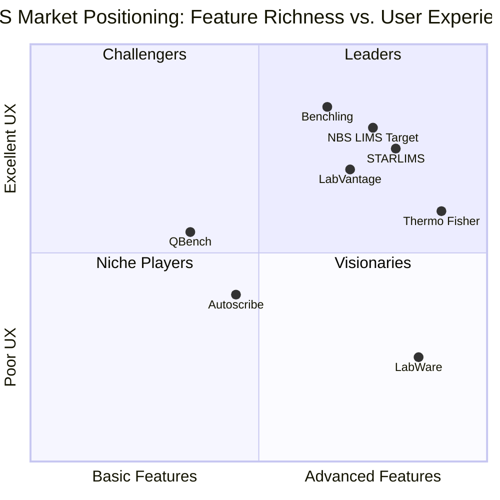

# NBS LIMS - Product Requirements Document (PRD)

## 1. Project Information

**Language:** English  
**Programming Language:** Shadcn-ui, TypeScript, Tailwind CSS  
**Project Name:** nbs_lims  
**Document Version:** 1.0  
**Date:** September 4, 2025  

### 1.1 Original Requirements Restatement

The NBS LIMS (Laboratory Information Management System) is a comprehensive web-based application designed to manage laboratory operations with multi-language support (English/Arabic RTL), offline-first PWA capabilities, and complex business workflows including sample tracking, supplier management, testing procedures, and purchasing workflows. The system must support role-based access control, advanced analytics, and seamless data synchronization with cloud storage.

## 2. Product Definition

### 2.1 Product Goals

1. **Streamline Laboratory Operations**: Create an integrated platform that eliminates manual processes and reduces operational errors by 80% through automated sample numbering, workflow management, and real-time status tracking.

2. **Enable Offline-First Laboratory Management**: Provide uninterrupted laboratory operations through PWA technology with local database storage, ensuring 99.9% system availability even during network outages.

3. **Facilitate Multi-Regional Compliance**: Support international laboratory standards with bilingual interface (English/Arabic RTL), comprehensive audit trails, and flexible approval workflows meeting regulatory requirements across different markets.

### 2.2 User Stories

**As a Lab Technician**, I want to quickly register new samples with auto-generated sequential numbers so that I can maintain consistent sample identification without manual tracking errors.

**As a Lab Lead**, I want to approve test results and formulas with a single click so that I can efficiently manage quality control processes and maintain clear approval chains.

**As a Purchasing Manager**, I want to track the complete lifecycle from sample requests to ordered items so that I can optimize procurement workflows and maintain inventory visibility.

**As an Admin**, I want to configure supplier-specific pricing tiers and scaling rules so that I can maintain accurate cost calculations for different volume requirements.

**As a Viewer**, I want to access real-time sample status and test results in both English and Arabic so that I can monitor laboratory operations regardless of my preferred language.

### 2.3 Competitive Analysis

#### LabWare LIMS
**Pros:** Established market presence, extensive customization options, regulatory compliance features
**Cons:** Outdated user interface, limited out-of-box functionality, poor documentation, slow performance

#### STARLIMS
**Pros:** High customer satisfaction (4.5/5 rating), user-friendly interface, comprehensive R&D platform, strong integration capabilities
**Cons:** Higher cost, complex implementation, requires extensive training

#### Thermo Fisher SampleManager
**Pros:** Market leader with 14% share, robust instrument integration, strong analytics capabilities
**Cons:** High licensing costs, complex deployment, limited mobile access

#### LabVantage
**Pros:** Cloud-native architecture, modern UI/UX, flexible workflow engine
**Cons:** Limited offline capabilities, newer market presence, integration challenges

#### Benchling
**Pros:** Modern cloud platform, excellent collaboration features, intuitive design
**Cons:** Primarily R&D focused, limited manufacturing support, subscription model only

#### Autoscribe Matrix Gemini
**Pros:** Cost-effective solution, good for small-medium labs, quick deployment
**Cons:** Limited scalability, basic analytics, minimal customization options

#### QBench
**Pros:** Affordable pricing, easy setup, good customer support
**Cons:** Limited advanced features, basic reporting, no offline support

### 2.4 Competitive Quadrant Chart



## 3. Technical Specifications

### 3.1 Requirements Analysis

The NBS LIMS system requires a sophisticated technical architecture that balances modern web technologies with robust offline capabilities. Key technical challenges include:

- **Offline-First Architecture**: Implementing PWA with IndexedDB/SQLite for local storage while maintaining data consistency
- **Bi-directional Synchronization**: Managing conflict resolution between local and cloud storage (Google Drive)
- **Multi-language RTL Support**: Proper Arabic text rendering and layout mirroring
- **Complex Business Logic**: Sample auto-numbering with database-wide uniqueness constraints
- **Role-Based Security**: Granular permissions system with section-level access control
- **Real-time Analytics**: Dashboard with KPIs and interactive charts
- **File Management**: Import/Export capabilities for CSV/XLSX/JSON formats

### 3.2 Requirements Pool

#### P0 Requirements (Must Have)

**Core Functionality**
- Sample management with auto-numbering (max existing + 1 rule)
- Supplier management with scaling price configurations
- Test management with Personal Use/Industrial workflows
- User authentication and role-based access control
- Basic CRUD operations for all entities

**Data Management**
- Local database storage (IndexedDB/SQLite)
- Data validation and integrity constraints
- Audit trail logging for all operations
- Import/Export functionality (CSV/XLSX/JSON)

**User Interface**
- Responsive web design (desktop-first)
- English/Arabic language switching
- RTL layout support for Arabic content
- Basic navigation and search functionality

#### P1 Requirements (Should Have)

**Advanced Features**
- PWA installation and offline capabilities
- Google Drive synchronization with conflict resolution
- Advanced analytics dashboard with KPIs
- Purchasing workflow (Requested → To Be Ordered → Ordered)
- Task management with Kanban boards

**Enhanced UI/UX**
- Dark/Light mode toggle
- Premium turquoise/black/white theme
- Advanced filtering and sorting
- Bulk operations and batch processing
- Real-time status updates

**Integration & Automation**
- Automated approval workflows
- Email notifications for status changes
- Advanced search with global scope
- Data visualization charts and graphs

#### P2 Requirements (Nice to Have)

**Premium Features**
- Advanced task management with subtasks and watchers
- Threaded comments system with different user colors
- File attachments for tasks and samples
- Advanced reporting with custom templates
- Mobile app companion

**Extended Integrations**
- Third-party laboratory instrument integration
- Advanced cloud storage providers
- API endpoints for external system integration
- Webhook support for real-time notifications
- Advanced security features (2FA, SSO)

### 3.3 UI Design Draft

#### Main Navigation Structure
```
Header: [Logo] [Language Toggle] [Theme Toggle] [User Menu] [Google Drive Status]
Sidebar: [Samples] [Tests] [Suppliers] [Purchasing] [Tasks] [Analytics] [Settings]
Main Content: [Breadcrumb] [Action Bar] [Content Area] [Status Bar]
```

#### Key Interface Components

**Sample Management Interface**
- Table view with status color coding (Green: Accepted, Light Red: Rejected)
- Quick action buttons (Edit, Add Test, Request Item, Export)
- Advanced filters (Supplier, Status, Purpose, Date Range, Approval Status)
- Sample detail drawer with grouped information sections

**Test Management Interface**
- Split view tabs: Personal Use | Industrial
- Conditional form fields based on test type
- Formula builder for Industrial tests with percentage calculations
- Approval toggle with visual indicators

**Purchasing Pipeline Interface**
- Three-column layout: Requested | To Be Ordered | Ordered
- Drag-and-drop or checkbox-based status transitions
- Green highlighting for ordered items
- Priority and purpose tag indicators

**Analytics Dashboard**
- KPI cards with trend indicators
- Interactive charts with date range filters
- Supplier performance breakdown
- Export capabilities for reports

### 3.4 Open Questions

1. **Sample Numbering Collision**: How should the system handle concurrent sample creation when multiple users are working offline and later sync to the same database?

2. **Google Drive Folder Structure**: What specific folder organization should be used for different data types (samples, tests, exports) in Google Drive sync?

3. **Approval Workflow Notifications**: Should the system send email notifications when samples are approved/rejected, and what email service should be integrated?

4. **Data Retention Policy**: How long should audit trail data be retained, and should there be automatic archiving of old records?

5. **Scaling Price Validation**: Should the system enforce ascending price validation for scaling tiers (25KG < 50KG < 100KG, etc.)?

6. **Multi-tenant Architecture**: Will the system need to support multiple laboratory organizations with data isolation?

7. **Backup and Recovery**: What backup strategy should be implemented for critical laboratory data beyond Google Drive sync?

8. **Performance Requirements**: What are the expected response times for search operations and report generation with large datasets (10K+ samples)?

## 4. Business Rules and Workflows

### 4.1 Sample Numbering Rule (Critical)
- **Rule**: Sample numbers MUST always continue from the highest existing number in the database + 1
- **Implementation**: On sample creation, query MAX(sample_no) from all existing samples (including imported data) and increment by 1
- **Example**: If imported data contains samples up to 465, next auto-generated number is 466
- **Validation**: System must prevent manual sample number entry to maintain uniqueness
- **Concurrency**: Handle offline scenarios where multiple samples might be created simultaneously

### 4.2 Approval Workflow
- Only ONE test/formula per sample can be marked as "Approved" at any time
- Approving a new test/formula automatically removes approval from previous tests
- Sample profile must clearly indicate which test/formula is currently approved
- Approval status affects sample overall status and visibility in reports

### 4.3 Supplier Scaling Rules
- **Givaudan**: Scaling enabled by default
- **Expressions**: Scaling disabled by default (single price only)
- **Admin Override**: Administrators can modify scaling settings for any supplier
- **Validation**: When scaling is enabled, all tier prices must be provided

### 4.4 Purchasing Workflow States
1. **Requested**: Created by Technicians, visible to Purchasing team
2. **To Be Ordered**: Intermediate state for Purchasing review
3. **Ordered**: Final state with order reference, affects sample status

### 4.5 Data Validation Rules
- Sample numbers must be unique across entire system
- Supplier names must be unique
- Test results must match predefined enum values
- Date fields default to current date but remain editable
- Required fields must be validated before save operations

## 5. Security and Permissions Matrix

### 5.1 Role Definitions

| Role | Samples | Tests | Suppliers | Purchasing | Tasks | Analytics | Settings | Users |
|------|---------|-------|-----------|------------|-------|-----------|----------|-------|
| **Admin** | Full CRUD | Full CRUD | Full CRUD | Full CRUD | Full CRUD | Full Access | Full CRUD | Full CRUD |
| **LabLead** | Full CRUD | Full CRUD | Read Only | Read Only | Assigned Tasks | Full Access | Read Only | None |
| **Technician** | Read Only | Create/Edit Assigned | Read Only | Create Requested | Assigned Tasks | None | None | None |
| **Purchasing** | Read Only | Read Only | Full CRUD | Full CRUD | Related Tasks | Purchasing Reports | None | None |
| **Viewer** | Read Only | Read Only | Read Only | Read Only | None | Read Only | None | None |

### 5.2 Data Security Requirements
- All user actions must be logged in audit trails
- Sensitive data encryption for local storage
- Secure authentication with session management
- Google Drive integration with OAuth 2.0
- Input validation and sanitization for all forms

## 6. Technical Architecture

### 6.1 Frontend Technology Stack
- **Framework**: React with TypeScript
- **UI Library**: Shadcn-ui components
- **Styling**: Tailwind CSS with RTL support
- **State Management**: Zustand or Redux Toolkit
- **PWA**: Service Workers with Workbox
- **Database**: Dexie.js (IndexedDB wrapper) or SQLite WASM

### 6.2 Offline-First Architecture
- **Local Storage**: Primary data storage in browser
- **Sync Engine**: Bi-directional sync with conflict resolution
- **Conflict Resolution**: Last-write-wins with version history
- **Background Sync**: Automatic sync when connection restored
- **Offline Indicators**: Clear UI feedback for connection status

### 6.3 Multi-language Implementation
- **Internationalization**: React-i18next for translations
- **RTL Support**: CSS logical properties and direction switching
- **Font Support**: Arabic web fonts with proper rendering
- **Date/Number Formatting**: Locale-aware formatting functions

### 6.4 Performance Requirements
- **Initial Load**: < 3 seconds on 3G connection
- **Search Response**: < 500ms for up to 10,000 records
- **Offline Capability**: Full functionality without internet
- **Data Sync**: Background sync without UI blocking
- **Memory Usage**: < 100MB for typical dataset

## 7. Analytics and Reporting

### 7.1 Key Performance Indicators (KPIs)
- **Sample Processing**: Accepted/Approved samples (last 30/90 days)
- **Quality Metrics**: Rejected/Retest/Rework percentages
- **Procurement Efficiency**: Requested vs Ordered conversion rates
- **Supplier Performance**: Acceptance rates by supplier
- **Turnaround Time**: Average processing time per sample type

### 7.2 Dashboard Components
- **Real-time KPI Cards**: Live updating metrics with trend indicators
- **Interactive Charts**: Bar/line charts with drill-down capabilities
- **Supplier Analysis**: Performance breakdown with filtering options
- **Export Capabilities**: PDF/Excel export for all reports
- **Date Range Filters**: Flexible time period selection

## 8. Implementation Phases

### Phase 1: Core Foundation (Weeks 1-4)
- Basic entity models (Samples, Suppliers, Tests)
- User authentication and role management
- Core CRUD operations
- Basic UI framework with theme support

### Phase 2: Advanced Features (Weeks 5-8)
- Sample auto-numbering implementation
- Approval workflow system
- Purchasing pipeline
- Import/Export functionality

### Phase 3: PWA and Sync (Weeks 9-12)
- Offline-first architecture
- Google Drive integration
- Conflict resolution system
- Performance optimization

### Phase 4: Analytics and Polish (Weeks 13-16)
- Analytics dashboard
- Advanced search and filtering
- Multi-language RTL support
- Task management system
- Final testing and deployment

## 9. Success Metrics

### 9.1 User Adoption Metrics
- **User Engagement**: Daily/Weekly active users
- **Feature Utilization**: Usage rates for key features
- **Error Rates**: System errors and user-reported issues
- **Performance**: Page load times and response rates

### 9.2 Business Impact Metrics
- **Operational Efficiency**: Reduction in manual processes
- **Data Accuracy**: Decrease in data entry errors
- **Compliance**: Audit trail completeness and accuracy
- **User Satisfaction**: User feedback and support tickets

### 9.3 Technical Performance Metrics
- **System Availability**: Uptime and offline capability
- **Data Sync Success**: Sync completion rates and conflict resolution
- **Security**: Zero security incidents and data breaches
- **Scalability**: Performance with increasing data volumes

## 10. Risk Assessment and Mitigation

### 10.1 Technical Risks
- **Data Loss**: Mitigated by robust backup and sync mechanisms
- **Performance Degradation**: Addressed through optimization and caching
- **Browser Compatibility**: Managed through progressive enhancement
- **Offline Sync Conflicts**: Resolved through conflict resolution algorithms

### 10.2 Business Risks
- **User Adoption**: Mitigated through comprehensive training and intuitive design
- **Regulatory Compliance**: Addressed through audit trails and validation
- **Data Migration**: Managed through careful import/export testing
- **Scalability**: Planned through modular architecture design

This PRD serves as the comprehensive blueprint for developing the NBS LIMS system, ensuring all stakeholder requirements are addressed while maintaining technical feasibility and business value.