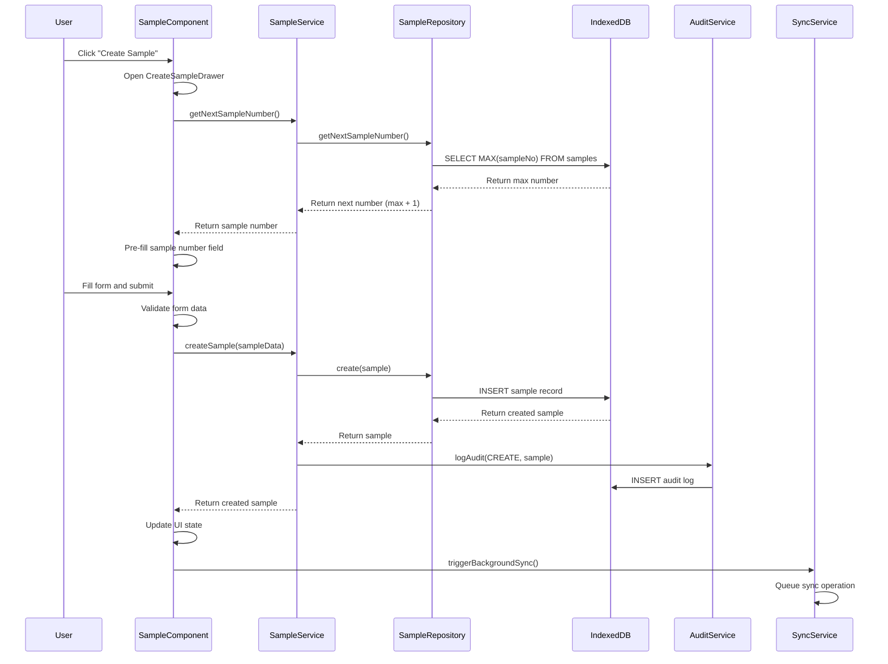
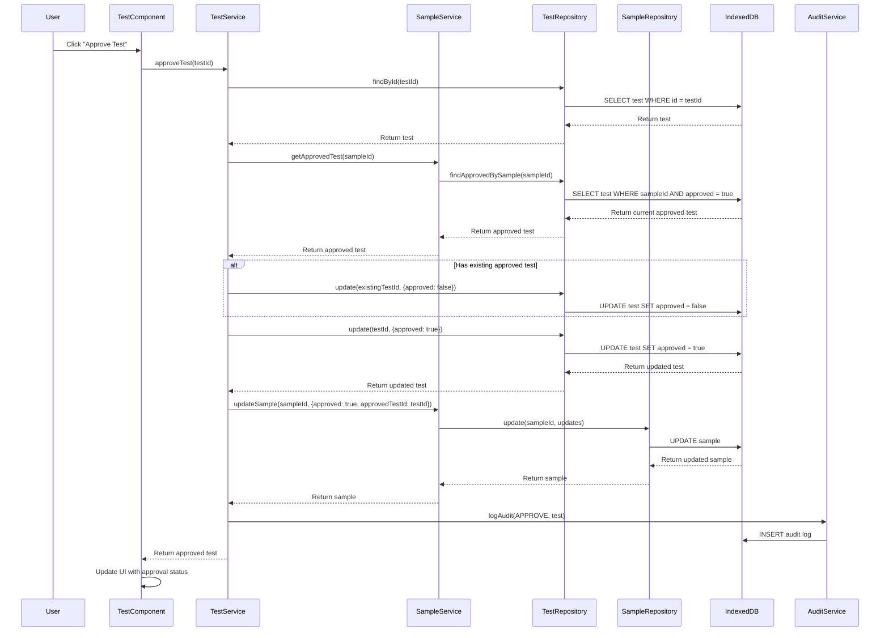
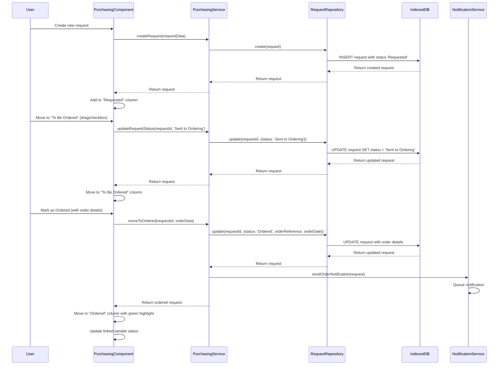
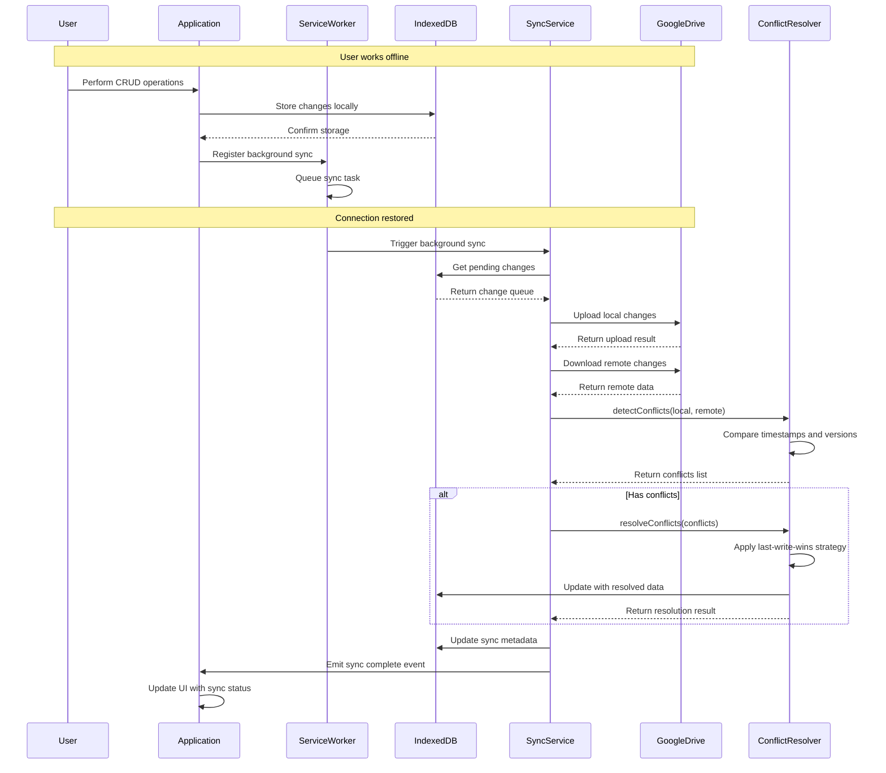
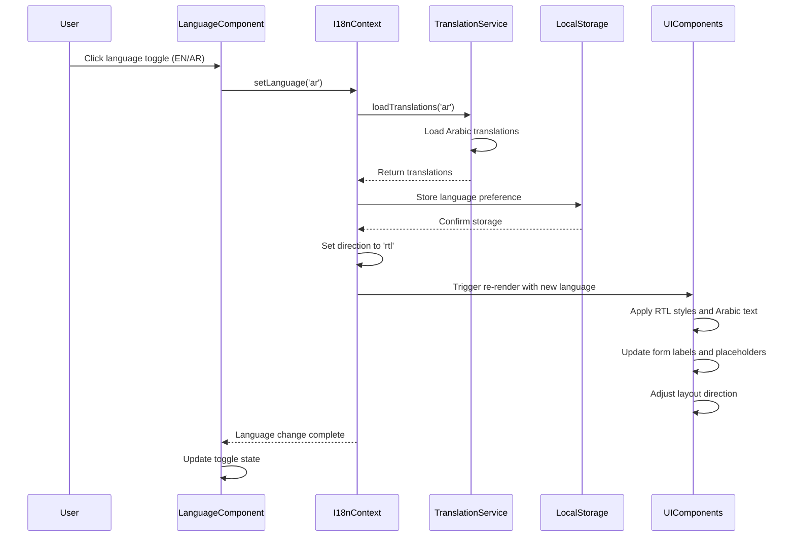
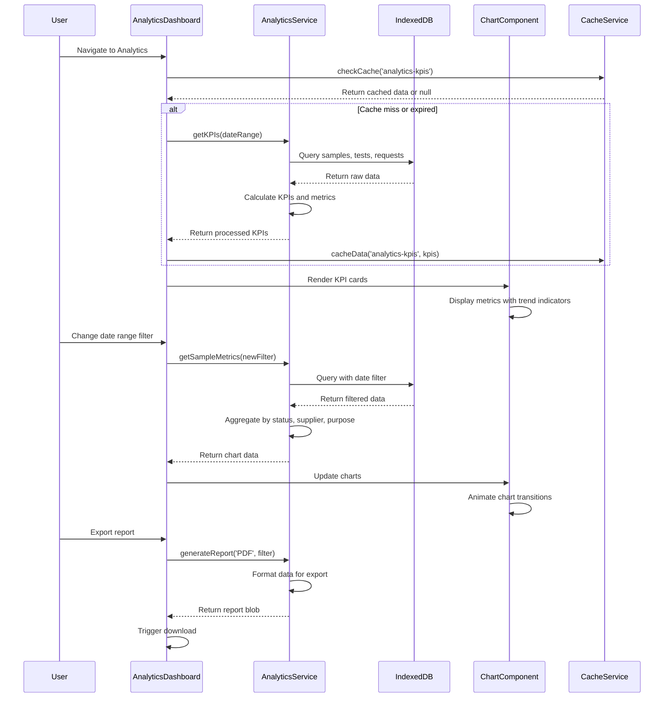

# NBS LIMS - System Design Document

## Implementation Approach

### Technology Stack Selection

**Frontend Framework**: Next.js 14 with React 18 and TypeScript for type safety and modern development experience. Next.js provides excellent PWA support, SSG/SSR capabilities, and built-in optimization features.

**UI Component Library**: Shadcn-ui built on Radix UI primitives with Tailwind CSS for consistent, accessible components and rapid styling. This combination provides excellent RTL support and theme customization capabilities.

**State Management**: Zustand for lightweight, TypeScript-friendly global state management. Redux Toolkit Query for server state management and caching.

**Local Database**: Dexie.js (IndexedDB wrapper) for robust offline-first data storage with excellent TypeScript support and advanced querying capabilities.

**PWA Implementation**: Next.js PWA plugin with Workbox for service worker management, background sync, and offline functionality.

**Multi-language Support**: next-i18next for internationalization with automatic RTL detection and layout switching.

**Authentication**: NextAuth.js for secure authentication with Google OAuth integration for Drive sync.

### Architecture Patterns

**Offline-First Architecture**: Primary data storage in IndexedDB with background synchronization to Google Drive. All operations work offline with automatic sync when connection is restored.

**Domain-Driven Design**: Clear separation of business logic into domain services, with repository pattern for data access abstraction.

**Component-Based Architecture**: Modular, reusable components with clear separation of concerns and consistent API patterns.

**Event-Driven Updates**: Real-time UI updates using custom hooks and event emitters for cross-component communication.

## Data Structures and Interfaces

### Core Entity Models

```typescript
// User and Authentication
interface User {
  id: string;
  email: string;
  name: string;
  role: UserRole;
  permissions: Permission[];
  preferences: UserPreferences;
  createdAt: Date;
  updatedAt: Date;
}

interface UserRole {
  id: string;
  name: 'Admin' | 'LabLead' | 'Technician' | 'Purchasing' | 'Viewer';
  permissions: Permission[];
}

interface Permission {
  resource: string;
  actions: ('create' | 'read' | 'update' | 'delete')[];
}

interface UserPreferences {
  language: 'en' | 'ar';
  theme: 'light' | 'dark';
  timezone: string;
}

// Sample Management
interface Sample {
  id: string;
  sampleNo: number; // Auto-generated, unique
  itemNameEN: string;
  itemNameAR: string;
  supplierId: string;
  batchNumber: string;
  dateOfSample: Date;
  purpose: Purpose;
  status: SampleStatus;
  approved: boolean;
  approvedTestId?: string;
  storageLocation: StorageLocation;
  customIdNo?: string;
  pricing: SamplePricing;
  createdBy: string;
  updatedBy: string;
  createdAt: Date;
  updatedAt: Date;
}

interface StorageLocation {
  cabinetNo: string;
  trayNo: string;
  refrigeratorShelf: string;
}

interface SamplePricing {
  basePrice: number;
  currency: string;
  scalingPrices?: ScalingPrice[];
}

interface ScalingPrice {
  tier: '25KG' | '50KG' | '100KG' | '200KG' | '500KG' | '1000KG';
  price: number;
}

// Supplier Management
interface Supplier {
  id: string;
  name: string;
  code?: string;
  contactInfo: ContactInfo;
  address: Address;
  scalingEnabled: boolean;
  notes?: string;
  createdAt: Date;
  updatedAt: Date;
}

interface ContactInfo {
  phone?: string;
  email?: string;
  contactPerson?: string;
}

interface Address {
  street: string;
  city: string;
  country: string;
  postalCode?: string;
}

// Test Management
interface Test {
  id: string;
  sampleId: string;
  useType: UseType;
  date: Date;
  result: TestResult;
  approved: boolean;
  personalUseData?: PersonalUseTest;
  industrialData?: IndustrialTest;
  createdBy: string;
  updatedBy: string;
  createdAt: Date;
  updatedAt: Date;
}

interface PersonalUseTest {
  topNote: string;
  baseNote: string;
}

interface IndustrialTest {
  formula: FormulaEntry[];
  formulaStatus: FormulaStatus;
}

interface FormulaEntry {
  id: string;
  percentage: number;
  item: string; // Sample reference or free text
  notes?: string;
}

// Purchasing Workflow
interface RequestedItem {
  id: string;
  itemName: string;
  sampleId?: string;
  quantity: number;
  unitOfMeasure: string;
  priority: Priority;
  purposeTag: PurposeTag;
  date: Date;
  status: RequestStatus;
  orderReference?: string;
  orderDate?: Date;
  notes?: string;
  createdBy: string;
  updatedBy: string;
  createdAt: Date;
  updatedAt: Date;
}

// Task Management
interface Task {
  id: string;
  title: string;
  description: string;
  assignees: string[];
  dueDate?: Date;
  priority: TaskPriority;
  status: TaskStatus;
  comments: TaskComment[];
  attachments: TaskAttachment[];
  watchers: string[];
  subtasks: SubTask[];
  createdBy: string;
  updatedBy: string;
  createdAt: Date;
  updatedAt: Date;
}

interface TaskComment {
  id: string;
  content: string;
  authorId: string;
  createdAt: Date;
  parentId?: string; // For threaded comments
}

interface TaskAttachment {
  id: string;
  filename: string;
  fileUrl: string;
  fileSize: number;
  mimeType: string;
  uploadedBy: string;
  uploadedAt: Date;
}

interface SubTask {
  id: string;
  title: string;
  completed: boolean;
  assigneeId?: string;
  createdAt: Date;
}

// Audit Trail
interface AuditLog {
  id: string;
  entityType: string;
  entityId: string;
  action: AuditAction;
  oldValues?: Record<string, any>;
  newValues?: Record<string, any>;
  userId: string;
  timestamp: Date;
  ipAddress?: string;
  userAgent?: string;
}

// Enums
type UserRole = 'Admin' | 'LabLead' | 'Technician' | 'Purchasing' | 'Viewer';
type Purpose = 'Personal Use' | 'Industrial';
type SampleStatus = 'Pending' | 'Testing' | 'Rejected' | 'Accepted';
type UseType = 'Personal Use' | 'Industrial';
type TestResult = 'Accepted' | 'Rejected' | 'Rework' | 'Retest';
type FormulaStatus = 'Success' | 'Rejected' | 'Retest';
type Priority = 'Air' | 'Sea' | 'Land';
type PurposeTag = 'Requested' | 'To fill the container with';
type RequestStatus = 'Requested' | 'Sent to Ordering' | 'Ordered';
type TaskPriority = 'Low' | 'Medium' | 'High' | 'Critical';
type TaskStatus = 'Backlog' | 'In Progress' | 'Waiting' | 'Done';
type AuditAction = 'CREATE' | 'UPDATE' | 'DELETE' | 'APPROVE' | 'REJECT';
```

### Service Layer Architecture

```typescript
// Repository Pattern for Data Access
interface Repository<T> {
  create(entity: Omit<T, 'id' | 'createdAt' | 'updatedAt'>): Promise<T>;
  findById(id: string): Promise<T | null>;
  findAll(filter?: FilterOptions): Promise<T[]>;
  update(id: string, updates: Partial<T>): Promise<T>;
  delete(id: string): Promise<void>;
  count(filter?: FilterOptions): Promise<number>;
}

// Sample Repository with Special Methods
interface SampleRepository extends Repository<Sample> {
  getNextSampleNumber(): Promise<number>;
  findBySampleNo(sampleNo: number): Promise<Sample | null>;
  findBySupplier(supplierId: string): Promise<Sample[]>;
  findApproved(): Promise<Sample[]>;
  bulkImport(samples: Partial<Sample>[]): Promise<Sample[]>;
}

// Service Layer
interface SampleService {
  createSample(data: CreateSampleRequest): Promise<Sample>;
  updateSample(id: string, data: UpdateSampleRequest): Promise<Sample>;
  approveSample(sampleId: string, testId: string): Promise<Sample>;
  importSamples(data: ImportSampleData[]): Promise<ImportResult>;
  exportSamples(format: ExportFormat, filter?: FilterOptions): Promise<Blob>;
  searchSamples(query: string, filter?: FilterOptions): Promise<Sample[]>;
}

interface TestService {
  createTest(data: CreateTestRequest): Promise<Test>;
  approveTest(testId: string): Promise<Test>;
  getTestsBySample(sampleId: string): Promise<Test[]>;
  getApprovedTest(sampleId: string): Promise<Test | null>;
}

interface PurchasingService {
  createRequest(data: CreateRequestRequest): Promise<RequestedItem>;
  moveToOrdered(requestId: string, orderData: OrderData): Promise<RequestedItem>;
  getRequestsByStatus(status: RequestStatus): Promise<RequestedItem[]>;
  bulkUpdateStatus(requestIds: string[], status: RequestStatus): Promise<RequestedItem[]>;
}

// Sync Service for Google Drive Integration
interface SyncService {
  syncToCloud(): Promise<SyncResult>;
  syncFromCloud(): Promise<SyncResult>;
  resolveConflicts(conflicts: DataConflict[]): Promise<void>;
  getLastSyncTime(): Promise<Date | null>;
  enableAutoSync(interval: number): void;
  disableAutoSync(): void;
}

interface DataConflict {
  entityType: string;
  entityId: string;
  localVersion: any;
  cloudVersion: any;
  conflictType: 'UPDATE_UPDATE' | 'UPDATE_DELETE' | 'DELETE_UPDATE';
}

// Analytics Service
interface AnalyticsService {
  getKPIs(dateRange: DateRange): Promise<KPIData>;
  getSampleMetrics(filter: AnalyticsFilter): Promise<SampleMetrics>;
  getSupplierPerformance(filter: AnalyticsFilter): Promise<SupplierPerformance[]>;
  getPurchasingMetrics(filter: AnalyticsFilter): Promise<PurchasingMetrics>;
  generateReport(type: ReportType, filter: AnalyticsFilter): Promise<Report>;
}
```

### Component Architecture

```typescript
// Base Component Props
interface BaseComponentProps {
  className?: string;
  children?: React.ReactNode;
}

// Form Components
interface FormFieldProps<T = any> extends BaseComponentProps {
  name: string;
  label: string;
  labelAR?: string;
  value: T;
  onChange: (value: T) => void;
  error?: string;
  required?: boolean;
  disabled?: boolean;
  placeholder?: string;
  placeholderAR?: string;
}

// Data Table Component
interface DataTableProps<T> extends BaseComponentProps {
  data: T[];
  columns: TableColumn<T>[];
  loading?: boolean;
  pagination?: PaginationConfig;
  sorting?: SortConfig;
  filtering?: FilterConfig;
  selection?: SelectionConfig<T>;
  actions?: TableAction<T>[];
  onRowClick?: (item: T) => void;
}

interface TableColumn<T> {
  key: keyof T;
  title: string;
  titleAR?: string;
  width?: number;
  sortable?: boolean;
  filterable?: boolean;
  render?: (value: any, item: T) => React.ReactNode;
}

// Modal/Drawer Components
interface DrawerProps extends BaseComponentProps {
  open: boolean;
  onClose: () => void;
  title: string;
  titleAR?: string;
  size?: 'sm' | 'md' | 'lg' | 'xl';
  position?: 'left' | 'right';
}

// Search Component
interface SearchProps extends BaseComponentProps {
  value: string;
  onChange: (value: string) => void;
  onSearch: (query: string) => void;
  placeholder?: string;
  placeholderAR?: string;
  suggestions?: SearchSuggestion[];
  loading?: boolean;
}

// Theme and Internationalization
interface ThemeContextValue {
  theme: 'light' | 'dark';
  toggleTheme: () => void;
  colors: ThemeColors;
}

interface I18nContextValue {
  language: 'en' | 'ar';
  setLanguage: (lang: 'en' | 'ar') => void;
  t: (key: string, options?: any) => string;
  dir: 'ltr' | 'rtl';
}

interface ThemeColors {
  primary: string;
  secondary: string;
  accent: string;
  background: string;
  surface: string;
  text: string;
  textSecondary: string;
  border: string;
  success: string;
  warning: string;
  error: string;
  turquoise: string;
}
```

## Program Call Flow

### Sample Creation and Management Flow



### Test Approval Workflow



### Purchasing Workflow State Transitions



### Offline-First Data Synchronization



### Multi-language and RTL Support Flow



### Analytics Dashboard Data Aggregation



## Anything UNCLEAR

### Technical Implementation Questions

1. **Sample Number Collision Handling**: The PRD specifies using MAX(existing) + 1 for sample numbering, but doesn't address concurrent offline creation scenarios. Should we implement a reservation system or use UUIDs with display numbers?

2. **Google Drive Sync Granularity**: Should the system sync individual records or batch changes? What's the optimal sync frequency and conflict detection strategy for large datasets?

3. **Arabic Font Loading Strategy**: Which Arabic web fonts should be used for optimal rendering, and should they be self-hosted or loaded from CDN for offline support?

4. **Performance Thresholds**: The PRD mentions <500ms search response for 10K records, but doesn't specify memory limits or maximum dataset size for offline storage.

5. **Approval Workflow Notifications**: Should approval state changes trigger real-time notifications to relevant users, and what notification delivery mechanism should be implemented?

6. **Data Migration Strategy**: How should existing laboratory data be migrated into the new system, and what validation rules should be applied during bulk imports?

7. **Backup and Recovery**: Beyond Google Drive sync, should the system implement additional backup mechanisms for critical data protection?

8. **Multi-tenant Considerations**: Will the system need to support multiple laboratory organizations with data isolation, or is it designed for single-tenant deployment?

### Business Logic Clarifications

1. **Scaling Price Validation**: Should the system enforce ascending price validation for scaling tiers, or allow flexible pricing structures?

2. **Test Result Enum Extensibility**: The PRD mentions Admin can add/edit test result options - should this be a runtime configuration or require code deployment?

3. **Audit Trail Retention**: What's the retention policy for audit logs, and should there be automatic archiving or purging mechanisms?

4. **Concurrent User Limits**: Are there any restrictions on simultaneous users or concurrent operations that need to be enforced?

5. **Data Export Compliance**: Are there any regulatory requirements for data export formats or audit trail inclusion in exports?

These clarifications would help ensure the implementation fully meets the business requirements and technical constraints while maintaining optimal performance and user experience.